I came up with these little spinning doodads a few years ago around Christmas, and I haven't seen anything like them online, so I'm writing about them here as they are quite fun to make.  I've just been calling these things "can spinners" (ChatGPT suggested "twirluminum").

<!-- 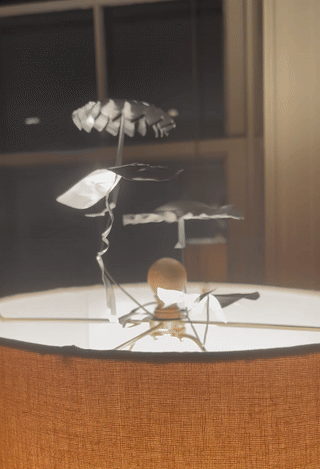 -->
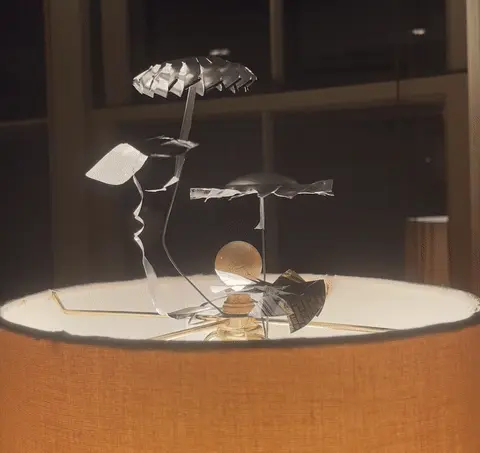

They remind me a bit of [candle carousels](https://en.wikipedia.org/wiki/Christmas_pyramid) that I would see at my grandparents' house, but in this case they are cut from recycled aluminum soda cans and spin on sharpened tips of wire from the heat rising off the lamp.

I got my family to create their own this year and it was interesting to see the variety of designs they came up with (see the gallery below).

# Construction

All the spinners shown above are made from sides and bottoms of recycled soda cans.

My process usually goes like this:

1. **Sharpen pivot wire.** 
   The spinners need a fine pivot point to sit on with low friction.  I used some steel craft wire that was laying around and sharpened it on a bench grinder.  Paper clips and sandpaper would probably work too.
   
   <figure>
   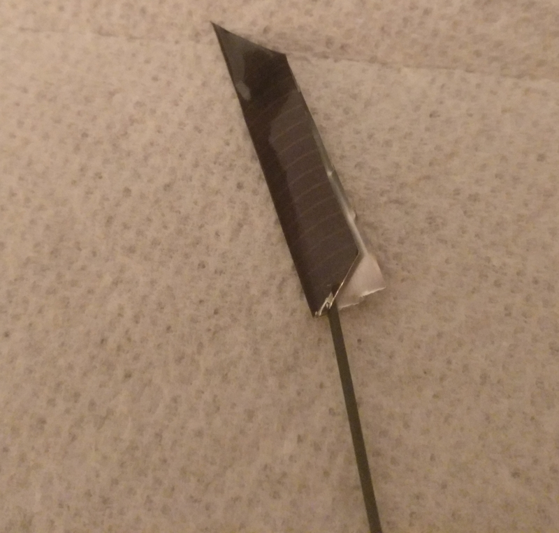
   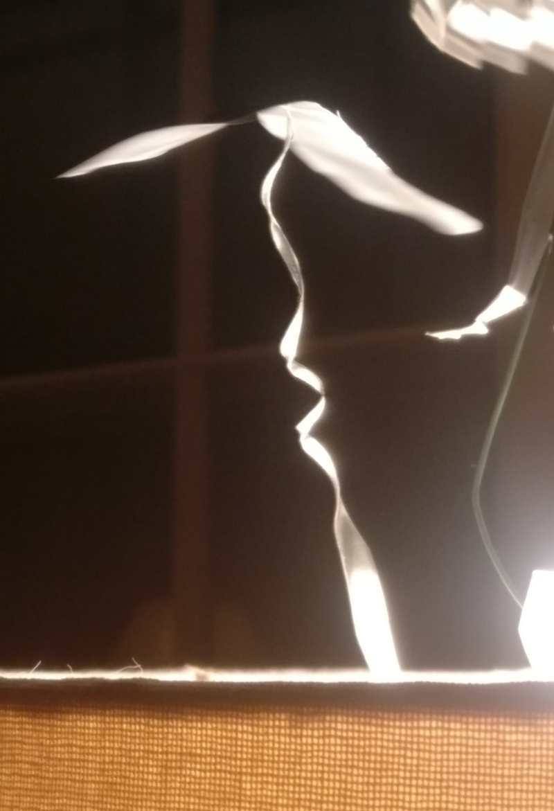
   <figcaption>Other ways to make a pivot.  Left: Square of aluminum folded over wire and cut to a point.  Right: Long strip of aluminum with point at the end.</figcaption>
   </figure>

3. **Cut out blank** 
    I've made these from the sides and bottoms of cans.  Can sidewalls are much easier to cut and bend, so I'd recommend starting with that.  Also be careful with the sharp scraps.  I've been jabbed a few times making these.

4. **Create the central dimple** 
   I usually just use a hard, blunt object like a ballpoint pen or pliers to push a dimple into the aluminum without crushing it.  Can bottoms are made from thicker aluminum, so I had to gently tap on the back of the pen with a hammer to make the dimple.
   It's very easy to accidentally pierce the aluminum so be careful!
   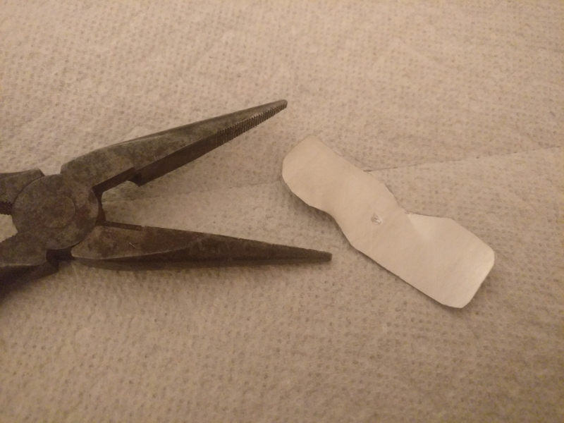

5. **Cut out blades and bend into shape.** 
   Small precision scissors work best to avoid distorting the aluminum and for making fine cuts.
   

6. **Trim and balance.** 
   Balance the spinner on the pivot wire in your hand.  Usually they're lopsided or fall off of their pivot initially, so trim small amounts of material from the outside until they spin well.
   
7. **Attach pivot wire to lamp** 
   Usually I'll just wrap the wire around the lampshade support (apparently this is called a "harp") or sandwich it under the lampshade nut for easy removal.
   
Incandescent bulbs work the best, but even LED bulbs are enough to get the spinners moving after warming up for a few minutes.  After a few weeks of spinning, I've noticed the spinners made of thinner sidewall aluminum have very small pinholes from the pivot wire wearing through, but they haven't stopped spinning!  The spinners made from can bottoms haven't had this problem yet.

# Gallery

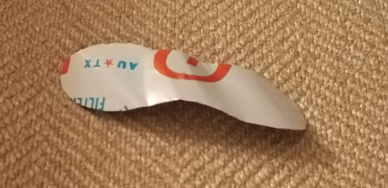

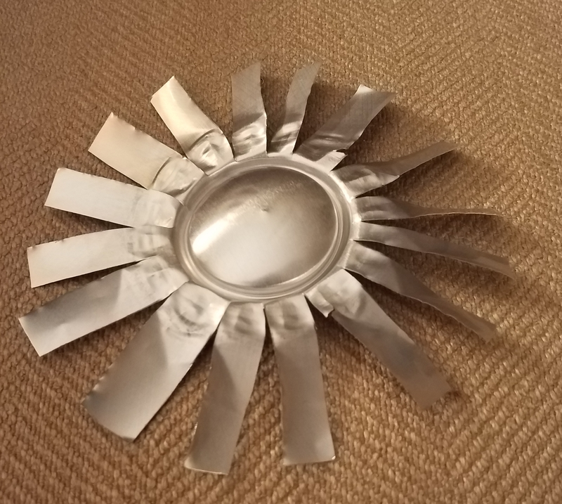
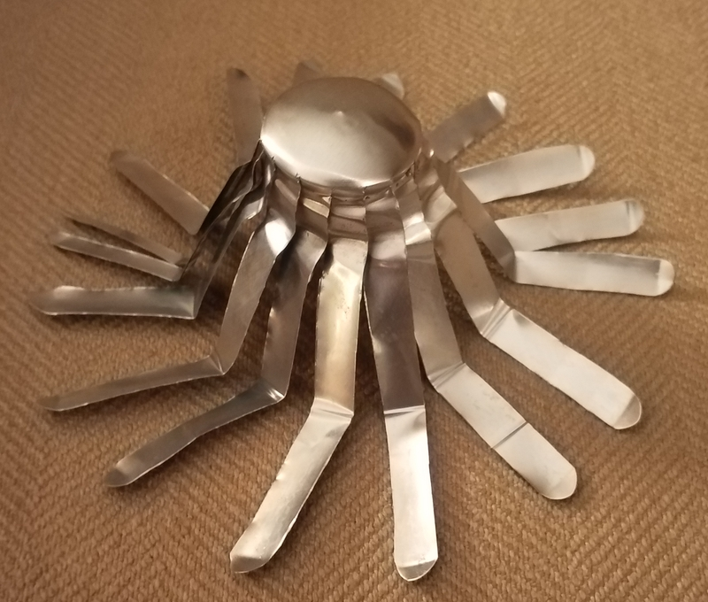
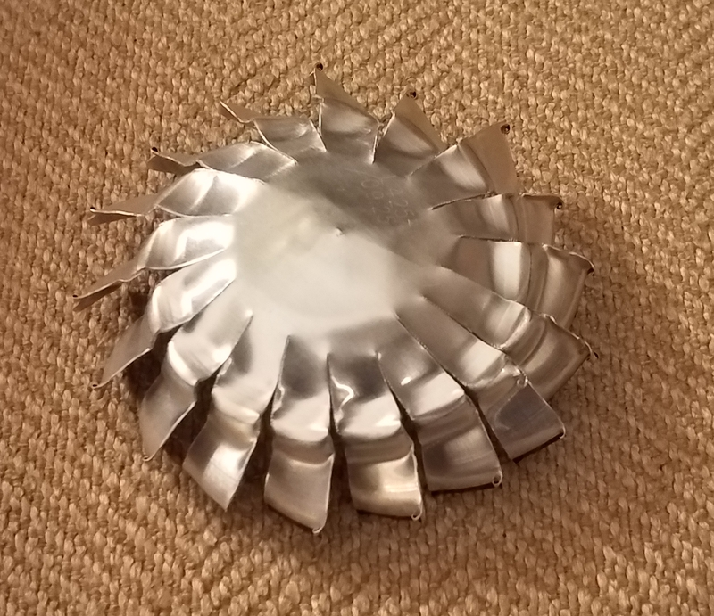
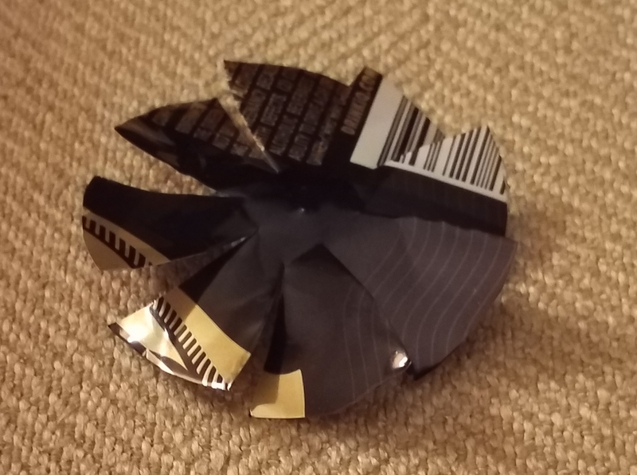

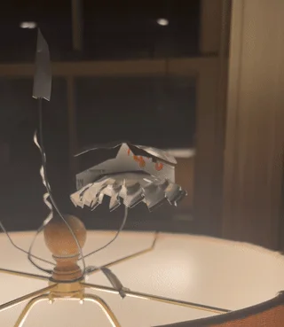
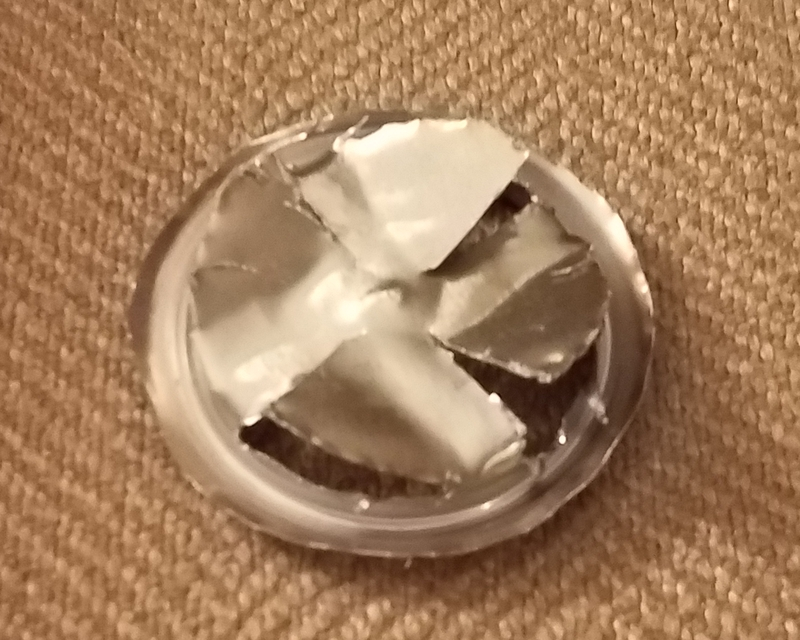
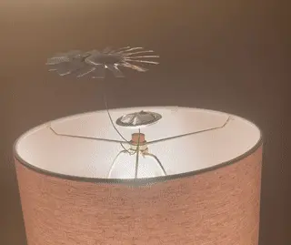