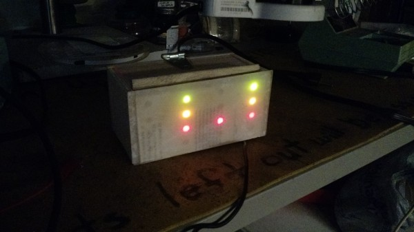

[Project Files](http://github.com/evidlo/binary_clock)
[Featured on Hackaday](http://hackaday.com/2015/07/20/scrappy-rgb-binary-clock-from-the-parts-bin/)

This is a binary clock that I threw together in a few days almost entirely with parts on hand.  Each digit that you would normally see on a digital clock is represented as columns of 4 bits, with the least significant bit on the top row.

I didn't want to spend any money on this project, so everything is made out of scrap balsa and acrylic.  The first piece I made was the display.  I sandwiched a few pieces of balsa together, drilled some holes and glued a piece of acrylic over the front to diffuse the LEDs.  I also glued in a white sheet of paper and sanded the front of the acrylic to give it a frosty look.

For driving the LEDs, I used the ubiquitous HC595 shift register.  I cut apart some small perfboard and soldered in an IC socket so the chips can easily be replaced if they burn out.  If you notice that the resistors are all different values, it's to make the brightnesses of all the colors match.

Next, I soldered up an attiny (again with IC socket) and added headers for the realtime clock (RTC) module, which communicates with the tiny via I2C. To set the time, I wrote some code that sets the time immediately on boot with some hardcoded value.  Then I just waited until that time came and plugged the clock in.  I only have to do this once, as the RTC module uses the battery to keep the time even when power is lost.

The last step was to glue the back on and add a hinged lid so I can reprogram the device if necessary.

This thing really gives off a nice glow at night.  I'm pleased with the results.
