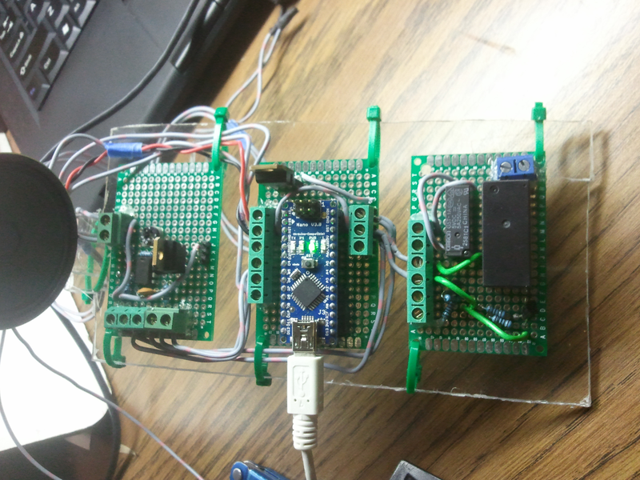
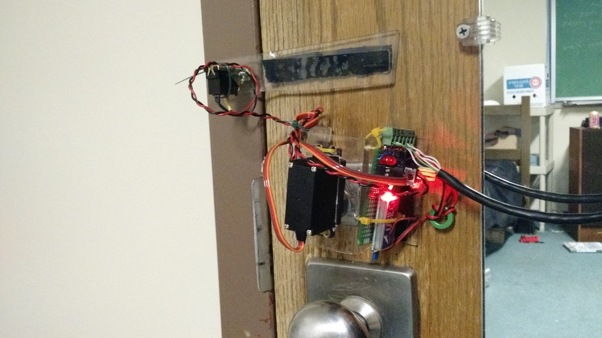
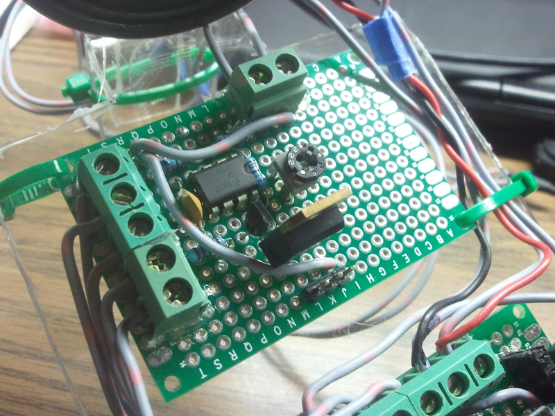

[Project files](http://github.com/evidlo/DAS)

This is a dorm automation system (DAS) I built at a hackathon with my freshman year roommate.  It features a remotely controllable door unlocker and relays for controlling lights.  We built a web interface for controlling the DAS remotely and viewing the state of the door while we're away.  The system also featured a piezoelectric sensor which would listen for a secret knock to open the door.  In the code, we normalized the knock based on the length of the first pulse so that the secret knock can be recognized regardless of the speed.
  Later on, I moved the boards into a gutted DSL modem.  I left the ports intact and soldered my boards to them.

      <iframe width="560" height="315" src="https://www.youtube.com/embed/Y7vDsM4oP3w" frameborder="0" allowfullscreen></iframe>

The door unlocker consists of a servo mounted over the deadbolt of the door and a sensing switch to detect when the door opens or closes.  Initially I was having issues with the long wire that connected the servo to the control circuitry.  The servo would pull lots of current and the voltage would plummet due to the impedance of the wire (a few ohms).  I remedied this by stepping up the voltage to 12V on the wire and then regulating it back down to 5V near the servo.  This is the same reason powerlines are usually at several kV which is then stepped down to the residential 110VAC.

{ style=width:31% .inline}
{ style=width:31% .inline}
{ style=width:31% .inline}
