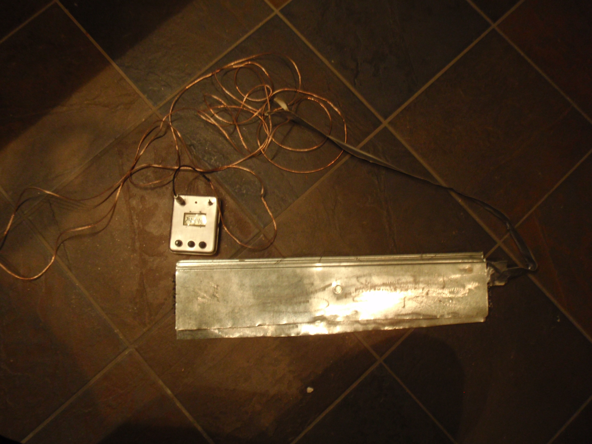
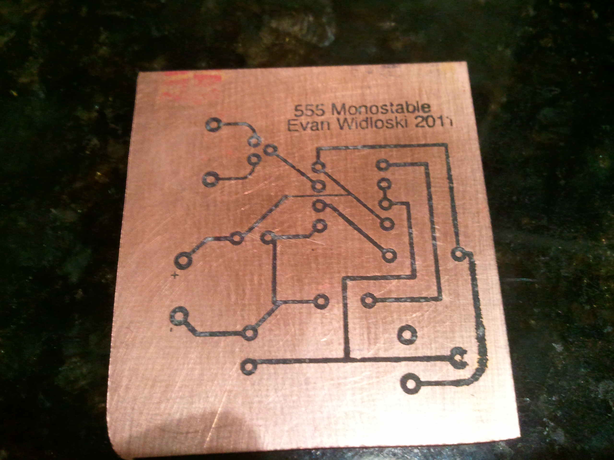
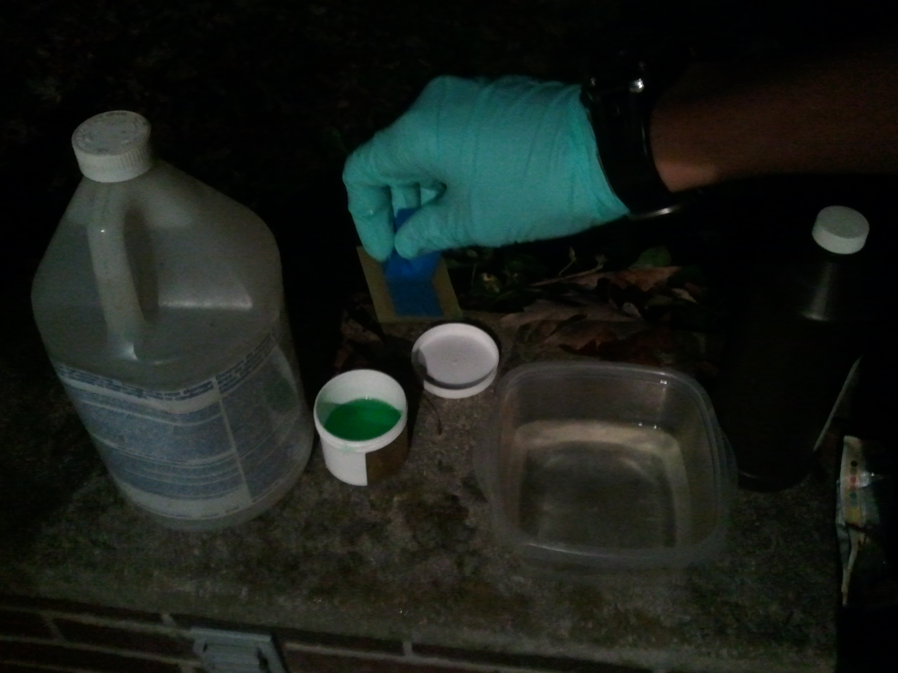
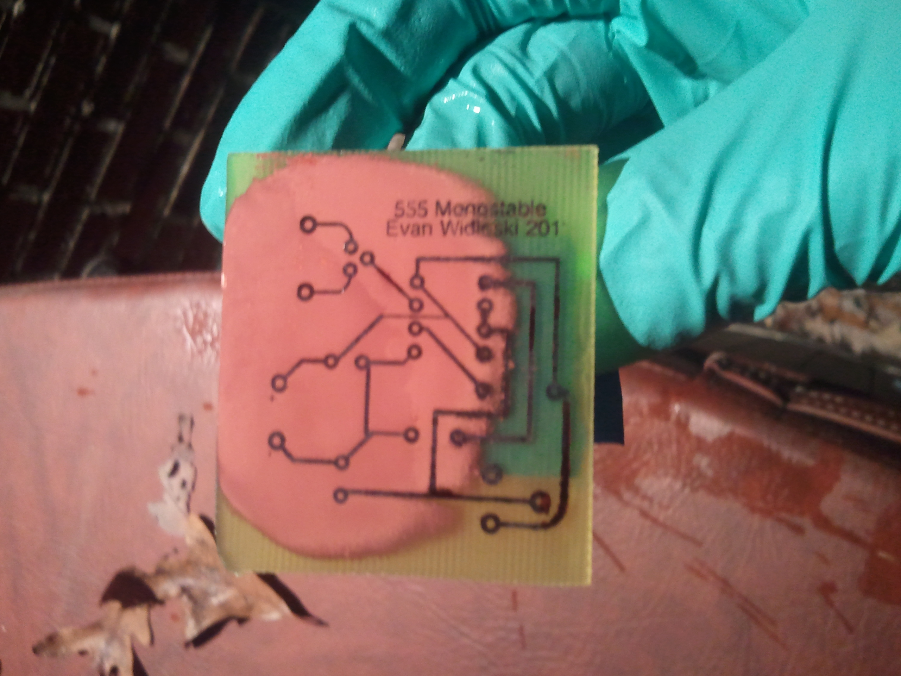
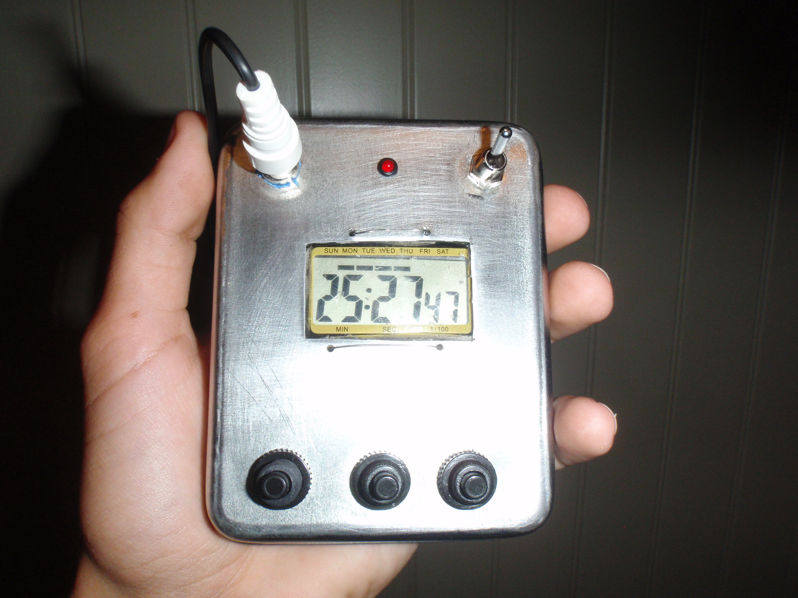

This is an old project from when I was younger to precisely time laps of a Go-kart on a dirt track.  I cannibalized a stopwatch and built a simple switch from some carpet sandwiched by two pieces of sheet metal.

The switch is connected to the start/lap button of the stopwatch and is triggered by the front wheels of the go-kart compressing the metal sheets together.  There is also a simple 555 monostable circuit to provide switch debouncing and to prevent the rear wheels of the go-kart to trigger the switch a second time.

