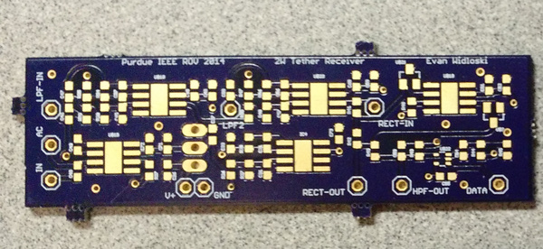
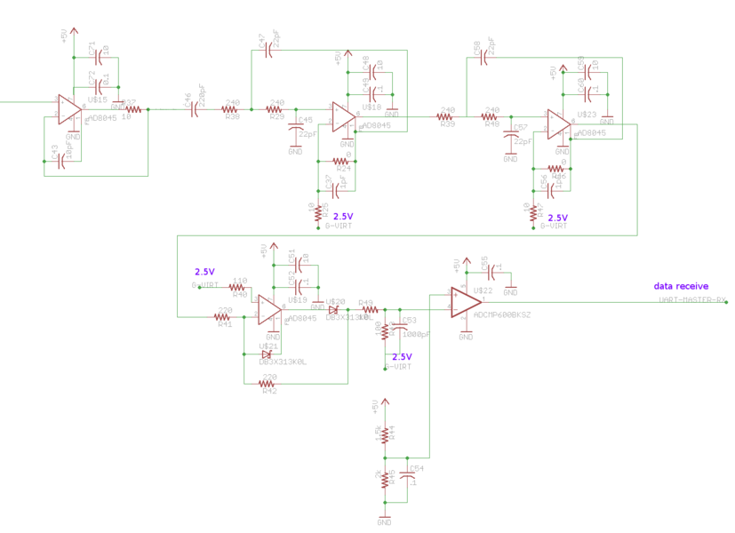

[Project files](http://github.com/evidlo/transmission)

Above are some prototype PCBs for a powerline transmission scheme I was helping develop on the Purdue IEEE ROV team.  A common problem on ROVs is the drag caused by pulling the tether through the water.  This tether contains channels for powering and communicating with the vehicle, and when systems like pneumatics or hydraulics are needed it begins to resemble an umbilical cord rather than a sleek cable.

One solution to this problem is to reduce the electrical cable thickness by reducing the number of channels.  This can be achieved by using [powerline transmission](https://en.wikipedia.org/wiki/Power-line_communication).  The basic idea is to take all your data channels and shift them to non-overlapping frequencies, add them together and inject them into the power cable.  On the receiving end, the data is separated from the power and split into its original components through the use of various filters.

The boards utilize a communication scheme called [amplitude shift keying]('https://en.wikipedia.org/wiki/Amplitude-shift_keying') (ASK) wherein a digital signal is modulated with a high frequency sine wave for the purpose of transmission.  Below is a SPICE simulation of what the data looks like after leaving the summing amplifier.

The next step is to receive the data and return it to a usable form.  For this we use a series of filters to eliminate unwanted signals and leave only the desired pngput.  Below, you can see circuit to extract the data stream and also some photos of the results. Don't pay too much attention to the schematic component values.

Overall, the prototype was a success and we were able to transmit and recover both streams over the powerline.  However, this system needs more fine tuning before it can be usable in the field.
