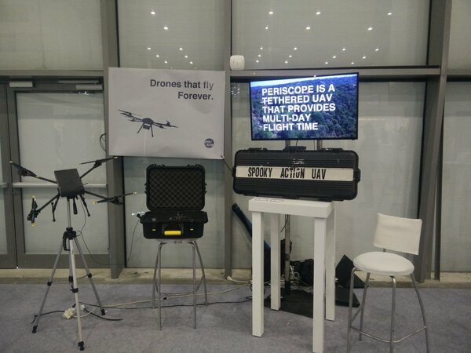
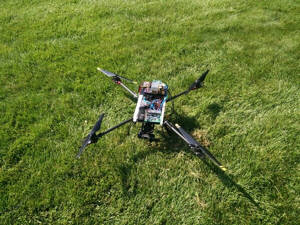
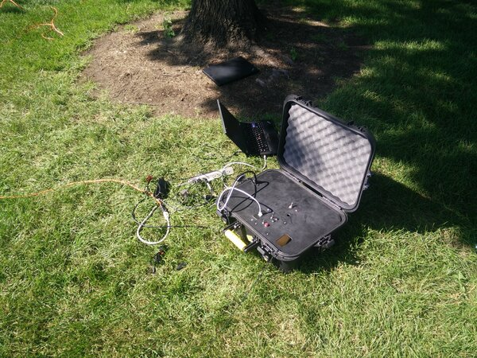
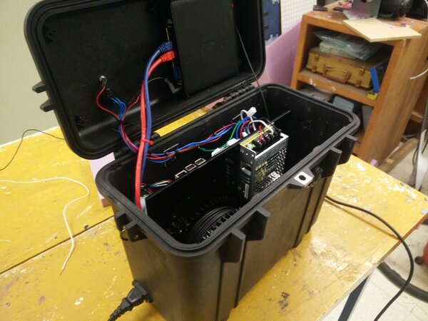
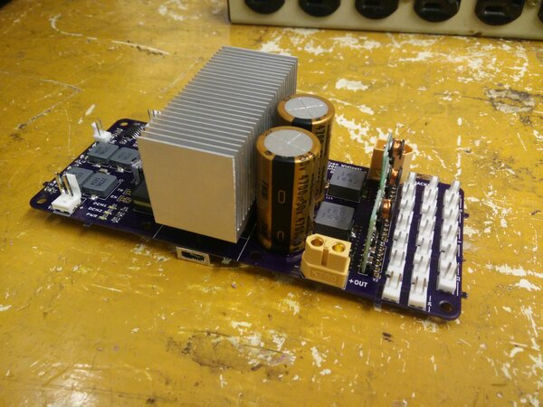
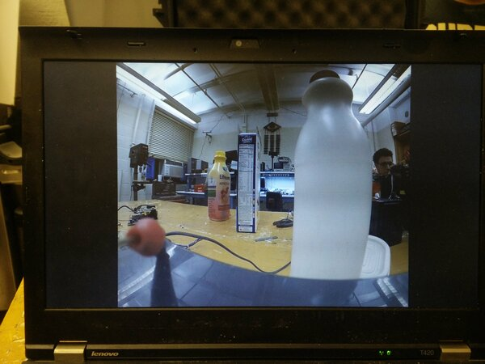

# Tethered Drone

This is a project I worked on with a few peers between undergrad and Masters.  The goals was to extend the flight duration of a drone from minutes to days or even weeks.  This accomplished with the use of a spooled, lightweight electrical tether which provides constant power to the drone and replaces its batteries.

The spooling system on the ground detects tension in the tether as the drone descends or ascends and spools in and out accordingly.  Additionally, there is a powerline injection module that sits at either end of the tether that provides an unjammable uplink/downlink to the vehicle for telemetry and video.

