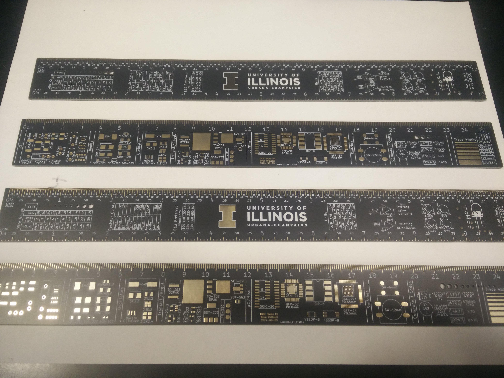

[Project files](http://github.com/evidlo/uiuc_ruler)

This is a board I designed to help students in UIUC's ECE senior design course.  PCB rulers are not a new idea, but this my spin on the idea with footprints I've found useful.

