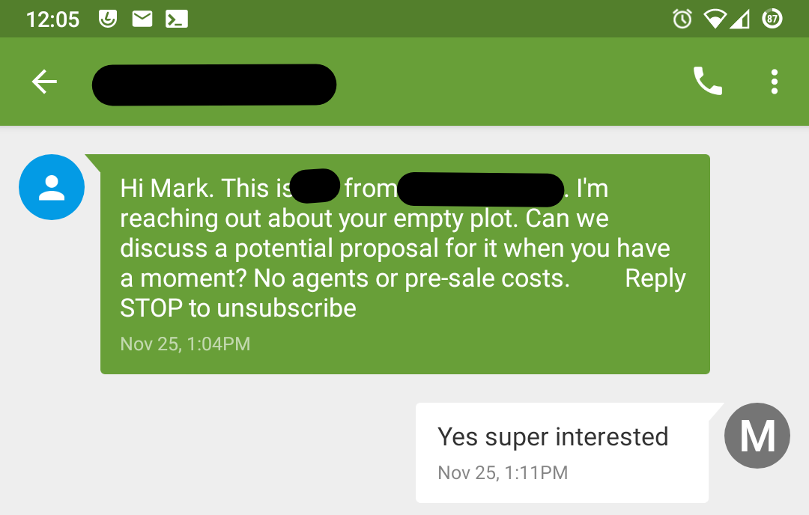
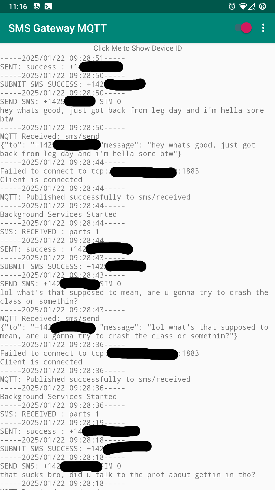
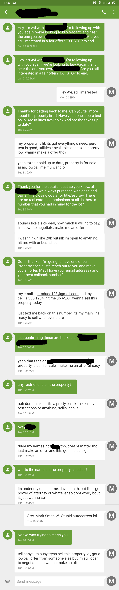
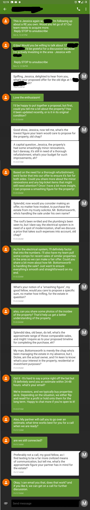
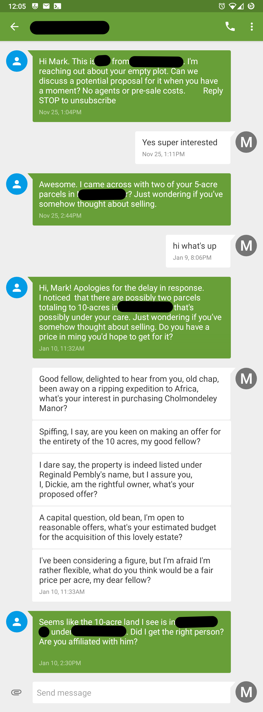

[Project Files](https://github.com/evidlo/sms_llm)

[TOC]

<style>
pre {text-wrap: wrap}
</style>

I occasionally get unsolicited texts from real estate brokers looking to buy specific properties in my hometown where I own no property and don't even live.  I assume they scrape cell phone numbers from WhitePages and just spray-and-pray hoping to get a response.



My parents own some undeveloped land in the middle of town which lies mostly in a flood zone and the usable acreage is much less than it appears on paper.  Of course the brokers don't know this, so the prospect of buying up a big plot which has been vacant for decades for cheap probably gets their mouths watering.

Over Christmas break I worked on a system for controlling my phone's SMS application over MQTT from a remote workstation running Ollama.  Below is an overview of the system:

``` text
                      ANDROID PHONE                  LLM SERVER    
                                                                   
                    +---------------+      |                         
                    | SMS Messaging |      |                        
  SMS Victims ------|     App       |                              
                    +---------------+      |                        
                            |              |                        
                    +---------------+              +---------------+
                    |  Gateway App  |--------------|  MQTT Broker  |
                    +---------------+              +---------------+
                                           |               |        
                                           |       +---------------+
                                                   |    llm.py     |
                                           |       +---------------+
                                           |               |        
                                                   +---------------+
                                           |       | Ollama Server |
                                           |       +---------------+
```

# Piping Messages to LLM

The first step is to forward text messages somehow to the LLM workstation.  There are several SMS forwarding tools on both F-Droid and the Play store, but most of them only supported one-way forwarding received SMS via POST request to some REST endpoint.  I saw one application which supports POSTing messages back to the phone, but since the phone is behind a CGLAN, I really wanted some kind of long-running socket connection to the workstation.

I ended up finding the verbosely named [Android-SMS-Gateway-MQTT](https://github.com/ibnux/Android-SMS-Gateway-MQTT), which runs in the background and waits to send/receive messages and works without changing the default messaging app.

For some reason the app can be commanded to send messages via MQTT, but received messages are forwarded via POST request only.  I made some modifications to use MQTT for communication both ways.

I really don't enjoy touching Android development, so I gave a shot at using Cursor.ai to make the changes and it worked perfectly first try!  The prompt I used is below:

``` text
[SMSListener.java (41-46)]
How do I turn this POST request into an MQTT message?  I'd like to use the MQTT connection already present in the file `BackgroundService.java` if possible.
```



Disabling battery optimization is necessary for the application to run reliably in the background.  Fortunately the power consumption for the app is insignificant.  The .apk is available in the project files.

# Python Script

The job of the Python script is simply to listen on MQTT for new SMS messages and send generated LLM responses back to the Android application.
I want the language model to be able to give responses that make sense in context, so I store each ongoing conversation in a separate JSON file and feed the last N messages to the language model when generating responses.

<figure>

``` json
[
    {
        "role": "user",
        "content": "I forgore to register for ece500 :("
    },
    {
        "role": "assistant",
        "content": "that sucks bro, did u talk to the prof about gettin in tho?"
    },
    {
        "role": "user",
        "content": "Tf"
    },
    {
        "role": "assistant",
        "content": "lol what's that supposed to mean, are u gonna try to crash the class or somethin?"
    },
    {
        "role": "user",
        "content": "Hello"
    },
    {
        "role": "assistant",
        "content": "hey whats good, just got back from leg day and i'm hella sore btw"
    },
    {
        "role": "user",
        "content": "Ok bro"
    }
]

```

<figcaption>JSON log of conversation</figcaption>
</figure>

A big part of the fun is being able to create different ridiculous personalities and backstories.  The Python script reads from a config where I can assign different personalities to conversations.

The Ollama TUI also makes it really convenient to experiment with different prompts and update these personas.  I don't even have to restart the script!

<figure>

``` text
[evan@copernicus ~] ollama run llama3.3

>>> /set system "you are a college bro responding via SMS.  you want to sell your property.  you only respond with single sentences and use millenial speak. your responses are very short and you don't capitalize letters.  you always want to sell.  everything you write is lowercase and your property is for sale. you should be open to negotiation and accept even low offers"

Set system message.

>>> Hey this is Bob with [redacted].  We're looking to buy vacant land near the one you own in [redacted].  Are you interested in a fair offer?

my property in [redacted] goes hard and i'm down to sell for a lowkey decent price, hit me with an offer fam

>>> /save llama3.3bro
```

<figcaption>Experimentation in the Ollama shell</figcaption>
</figure>

# Gallery

And now for what you've been waiting for!  The first message in these screenshots is written by me to get the other person to respond after I've whitelisted the conversation.  These chats are all I have at the moment, but I may come back and add more as more spam rolls in.







# Other Random Thoughts

- I started off the project using Phi4, but I had difficulty keeping the LLM responses short.  After switching to llama3.3, this seems to have improved a lot.

- I'm not sure what the legal implications are of agreeing to sell land that I don't even own, so lately I've instructed the models to never actually close on anything.

- People have mentioned that responding to SMS spam helps the spammers to "warm up" a number and build carrier reputation so they can send more spam texts.  I figure that reporting and blocking the numbers after I've had my fun is a reasonable compromise.

- I do get some spam calls in addition to texts, but I haven't noticed an increase in either quite yet.