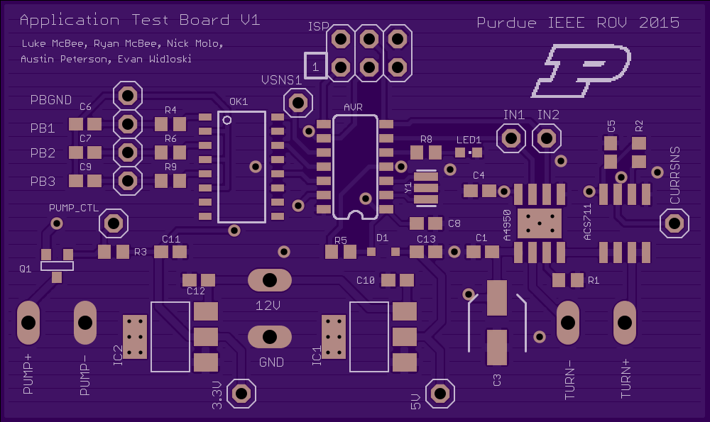
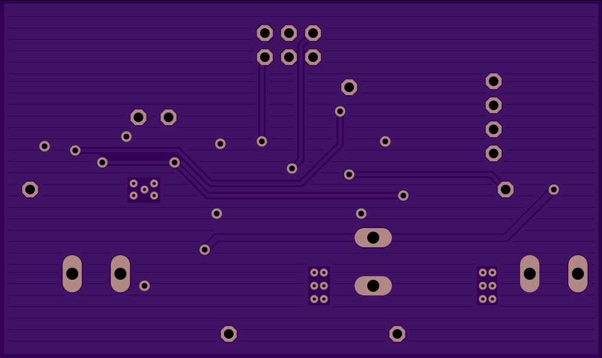
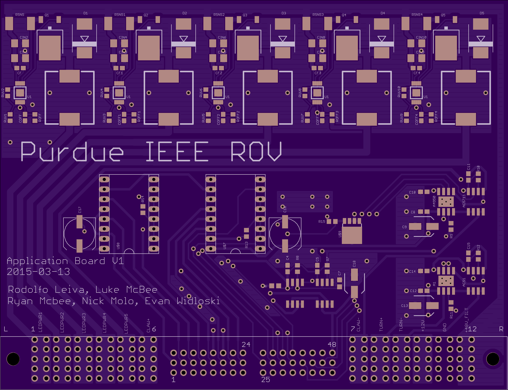
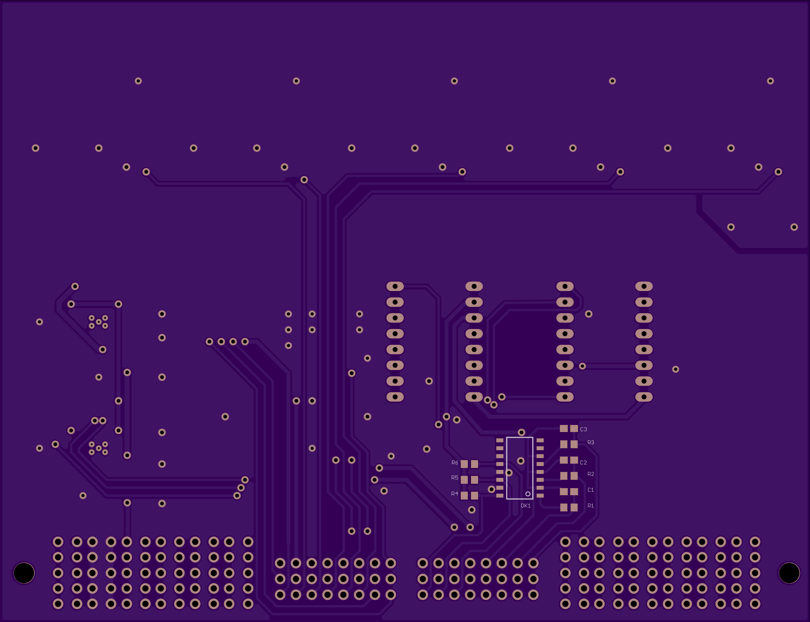

[Project files](http://github.com/evidlo/application)

This board was developed for the Purdue ROV team to read sensor data and control various tools.  This way, all the missions specific circuitry is kept on a single board that can be swapped out from year to year and minimize costs.

Shown above is a test unit to make sure the design worked with our various peripherals.  Below is the final design with the following features:

- 5 high power LED drivers for ROV floodlights
- 2 current-monitored stepper drivers for camera gimbal
- 2 current-monitored hbridges for a valve turner and gripper
- 2 servo current monitors for the gripper fingers
- isolated volt meter (on back)
- simple on/off control for a pump

