[Project files](https://github.com/purdue-orbital/balloon/tree/ca629042153116074ea130b4dc4988381f901386)

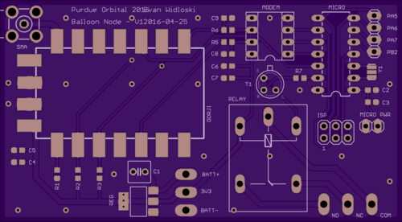
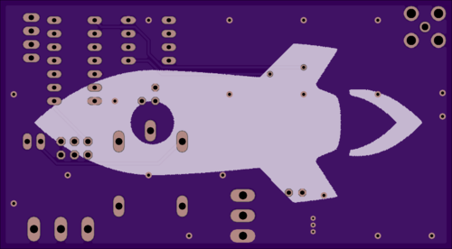


### Problem

This is a prototype for a high altitude balloon project I worked on with the Purdue Orbital rocketry team. I designed this board to test the range and power draw of our comms system and threw on a relay and microcontroller so that it can be used for triggering things on a real flight.

One of the FAA requirements is that balloons over a certain weight have four cutdown systems (two on the balloon envelope and two on the payload tether) and that these systems must be independent, meaning they are electrically disconnected from each other and have separate batteries.  Many amateurs balloonists overlook this rule, but due to our close work with the FAA it is important that we follow the regulations.

### APRS and Modem selection

To save on cost, I avoided the higher end radio specific devices on the market and stuck to hobby-tier components.  First was the Baofeng DRA818V.  This is cheap Chinese VHF transceiver that costs less than $20 on Amazon and has a decent amount of power.  Some users claim that these devices bleed onto other channels and should have a lowpass filter on the output (mine is inline with the coax).  There is also a UHF band available, but I chose VHF for potential future compatibility with the [APRS](https://en.wikipedia.org/wiki/Automatic_Packet_Reporting_System) system.  APRS will be an essential part of the system, because most radios in this power level (0.5 - 1W transmission) can only achieve a few dozen miles tops transmitting from ground to balloon.  The incorporation of APRS will greatly extend this range by taking advantage of amateur repeating stations called `digipeaters`.

Since this radio module is for handheld units that transmit audio, I needed some sort of modem for converting data to an analog format and vice-versa.  One of the methods of modulation I investigated was DTMF, which is used commonly in amateur radio and is built in to many consumer units.  However, DTMF modems tend to be rather large pin-wise and aren't compatible with most digipeaters, so I decided to build one from scratch using my favorite microcontroller, the ATTiny85.  For starters, I need to modulate and demodulate incoming data (known as `symbols` in communications) so they can be transmitted over the air.  In this case, most digipeaters use a standard known as `Bell-202` (also known as AFSK-1200), which is a simple modulation scheme where a logic 1 (mark) is represented by a 1200 Hz tone and a logic 0 (space) is represented by a 2200 Hz tone.  I accomplished this by calculating an 8-point DTFT at 1200 Hz and 2200 Hz at a sample rate of 9600 Hz (determined through testing).  I didn't use the FFT here because I'm only interested in the spectral power at two points.


Once I generated my DTFT coefficients, I used the [Q number format](https://en.wikipedia.org/wiki/Q_%28number_format%29), which is a method of handling signed fractional numbers within fixed point datatypes.  I wrote a bit of code to do the conversion.

#### Calculating coefficients

``` octave
#!/bin/octave
## Evan Widloski - 2016-10-15
## calculate DTFT coefficients and express as binary fractions

## ----- Convert decimal numbers to n bit signed binary fractions -----
function out = dec2binfrac(x,n)
  ## round input array to nearest 1/(2^n)
  x = round(x * 2^n)/(2^n);
  k = [1:n-1];
  if (x < 0)
    x = 1+x;
    out = -2^(n-1);
  else
    out = 0;
  endif
  twos_complement = mod(abs(x),.5.^(k-1)) >= .5.^k;
  bin_values = 2.^[n-2:-1:0];
  out += sum(bin_values .* twos_complement);
endfunction

## ----- Create coefficients for implementation in C -----
N = 8

## generate DFT coefficients
Xd1 = e.^(-i*2*pi*(1200/9600)*[0:N-1]);
Xd2 = e.^(-i*2*pi*(2200/9600)*[0:N-1]);

## scale down coefficients by 1 bit, since `1` can't be expressed as binary fraction
## e.g. scale 1 to 127/128
Xd1 = Xd1*((2^(N-1) - 1)/2^(N-1));
Xd2 = Xd2*((2^(N-1) - 1)/2^(N-1));

## express coefficients as signed N-bit binary fractions (Q7)
arrayfun(@(x) dec2binfrac(x,N),real(Xd1))
arrayfun(@(x) dec2binfrac(x,N),imag(Xd1))
arrayfun(@(x) dec2binfrac(x,N),real(Xd2))
arrayfun(@(x) dec2binfrac(x,N),imag(Xd2))
```

This yielded 4 arrays which would calculate the DFT at 1200 and 2200 Hz with a 9600 Hz sample rate.

### Simulation

Before implementing my code on the ATTiny, I wanted to do some verification and evaluate performance.  Fortunately, Octave has a [C/C++ api](https://www.gnu.org/software/octave/doc/v4.0.1/Getting-Started-with-Oct_002dFiles.html) which allowed me to test my code with the same bit-precision as I would have on the microcontroller.  Below you can see the 4 arrays of DTFT coefficients (generated previously) in Q.7 number format (1 sign bit, 7 data bits).

``` c
// Evan Widloski - FSK Computation
// Intended to be called from Octave
#include <octave/oct.h>
#include <stdint.h>
#include <math.h>

// Input: 8 element row-vector containing time samples, 9600 samp/s
// Output: 1 element. DTFT(2200) - DTFT(1200)

DEFUN_DLD(compute_cpp, args, , "FSK"){
// get input vector from args
int8NDArray arg = args(0).vector_value();
int8_t in[8] = {arg(0), arg(1), arg(2), arg(3), arg(4), arg(5), arg(6), arg(7)};
printf("input:%d,%d,%d,%d,%d,%d,%d,%d\n",in[0],in[1],in[2],in[3],in[4],in[5],in[6],in[7]);

// define coefficient vectors
int8_t coeff_1200_real[8] = {127,   90,    0,  -90, -127,  -90,    0,   90};
int8_t coeff_1200_imag[8] = {  0,  -90, -127,  -90,    0,   90,  127,   90};
int8_t coeff_2200_real[8] = {127,   16, -123,  -49,  110,   77,  -90, -101};
int8_t coeff_2200_imag[8] = {  0, -126,  -33,  117,   63, -101,  -90,   77};

int16_t dtft_1200_real, dtft_1200_imag, dtft_2200_real, dtft_2200_imag;
dtft_1200_real =  dtft_1200_imag =  dtft_2200_real =  dtft_2200_imag = 0;

for (int i = 0; i < 8; i++){
  dtft_1200_real += (int8_t)(((int16_t)in[i]*(int16_t)coeff_1200_real[i])>>7);
  dtft_1200_imag += (int8_t)(((int16_t)in[i]*(int16_t)coeff_1200_imag[i])>>7);
  dtft_2200_real += (int8_t)(((int16_t)in[i]*(int16_t)coeff_2200_real[i])>>7);
  dtft_2200_imag += (int8_t)(((int16_t)in[i]*(int16_t)coeff_2200_imag[i])>>7);
}
dtft_1200_real = dtft_1200_real>>3;
dtft_1200_imag = dtft_1200_imag>>3;
dtft_2200_real = dtft_2200_real>>3;
dtft_2200_imag = dtft_2200_imag>>3;

int16_t dtft_1200 = dtft_1200_real*dtft_1200_real +
                    dtft_1200_imag*dtft_1200_imag;
int16_t dtft_2200 = dtft_2200_real*dtft_2200_real +
                    dtft_2200_imag*dtft_2200_imag;
// dtft_1200 = sqrt(dtft_1200);
// dtft_2200 = sqrt(dtft_2200);

return octave_value(dtft_2200 - dtft_1200);
return octave_value(dtft_2200);
      }
```

Initially, I generated my test signals incoherently, meaning that the phase resets each time the signal transitions from a mark to a space and vice versa.  This creates discontinuities and adds noise to the spectrum in the transition regions.  From the results below, it was clear that my implementation really needed to be coherent.

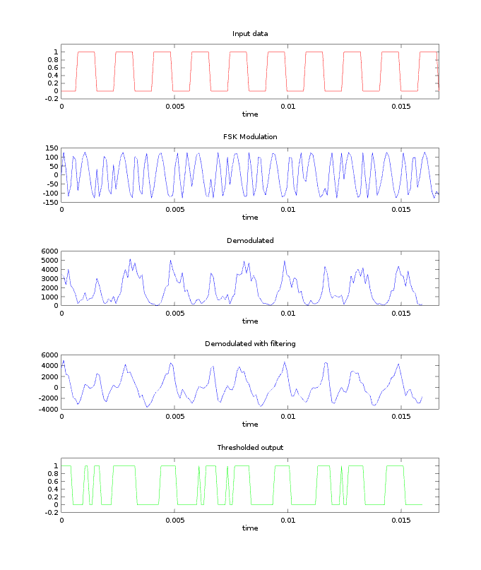{: style=max-width:100% }
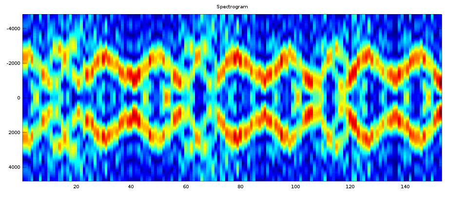
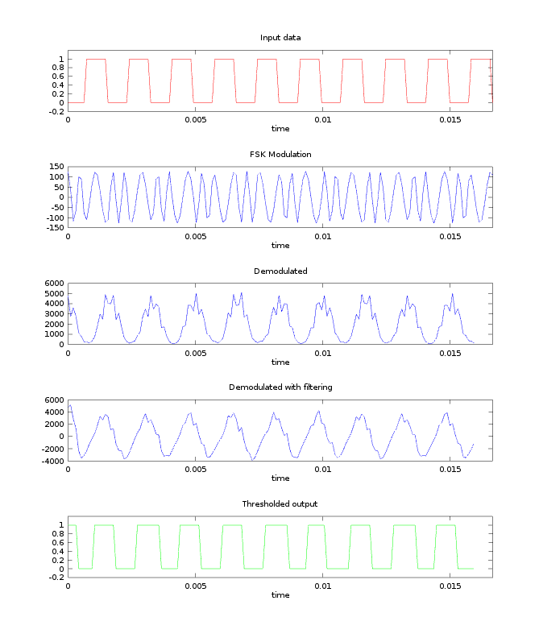{: style=max-width:100% }
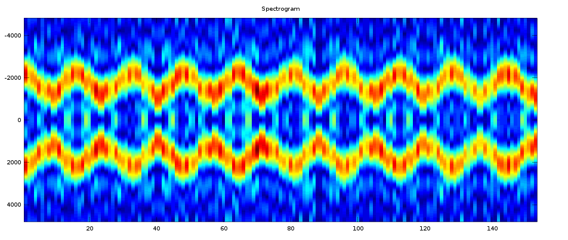

### Bit synchronization

At this point, the modem had no awareness of bits. The modem simply modulated at 1200 or 2200 Hz if it saw a logic 1 or 0 and vice versa for demodulation. If you look carefully at the thresholded output, you'll notice that the widths of the pulses are not exactly the same. This was problematic because UARTs operate asynchronously (without a clock line) and depend on the timing and width of bits to be precise. To solve this problem, I wrote some simple code that detects the phase of the thresholded output and samples it at regular intervals to ensure that the UART is receiving equally spaced bits.

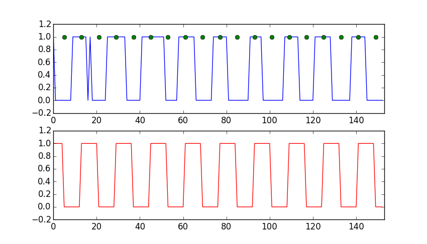

``` python
#!/bin/python
## Evan Widloski - 2016-11-27
## Test bit synchronization algorithm
from itertools import cycle
import matplotlib.pyplot as plt
import numpy as np

## inputs generated from simulation.m
## noisy input
# input = [1, 1, 1, 1, 0, 0, 0, 0, 0, 0, 1, 1, 1, 1, 1, 1, 1, 1, 0, 0, 0, 0, 0, 0, 0, 0, 1, 1, 1, 1, 1, 1, 1, 1, 0, 0, 0, 0, 0, 0, 0, 0, 1, 1, 1, 1, 1, 1, 1, 1, 0, 0, 0, 0, 0, 0, 0, 0, 0, 1, 1, 1, 1, 1, 1, 1, 0, 0, 0, 0, 0, 0, 0, 0, 1, 1, 1, 1, 1, 1, 1, 0, 1, 0, 0, 0, 0, 0, 0, 0, 1, 1, 1, 1, 1, 1, 1, 0, 0, 0, 0, 0, 0, 0, 0, 0, 1, 1, 1, 1, 1, 1, 1, 1, 0, 0, 0, 0, 0, 0, 0, 0, 1, 1, 1, 1, 1, 1, 1, 1, 1, 0, 0, 0, 0, 0, 0, 0, 0, 1, 1, 1, 1, 1, 1, 1, 0, 0, 0, 0, 0, 0, 0]


bit_period = 8

last_change_time = 16
last_bit_time = 0
last_bit = 1
sync = []
output = []
bit_get = []
for bit in input:
    if last_change_time > 15 and bit != last_bit:
        last_bit_time = bit_period/2
        last_change_time = 0
        sync.append(1)
    else:
        sync.append(0)
    if last_bit_time == 8:
        if bit != last_bit:
            last_change_time = 0
        last_bit = bit
        last_bit_time = 0
        bit_get.append(1)
    else:
        bit_get.append(0)

    last_change_time += 1
    last_bit_time += 1
    output.append(last_bit)


input = np.array(input)
output = np.array(output)
bit_get = np.array(bit_get)
sync = np.array(sync)

plt.subplot(2,1,1)
plt.plot(input, 'b')
plt.plot(np.where(bit_get == 1),1, 'go')
plt.title('Thresholded input')
plt.axis([0, len(output), -.2, 1.2])
# plt.plot(sync, 'g')
plt.subplot(2,1,2)
plt.plot(output, 'r')
plt.title('Final output')
plt.axis([0, len(output), -.2, 1.2])
plt.show()
```

The algorithm waits for a quiet period (no data being transmitted), then synchronizes on the first bit edge it sees.  So long as there are breaks between transmitted packets, the algorithm works well enough to clean up the incoming bit stream.

### Construction


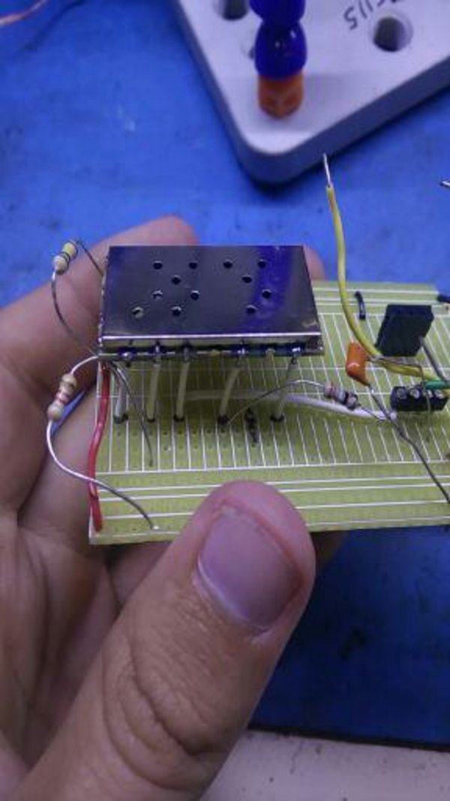
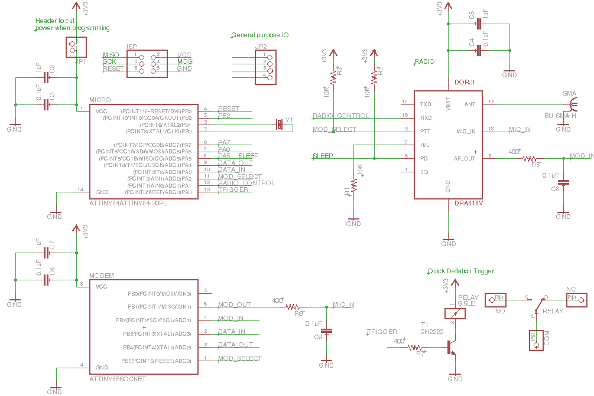
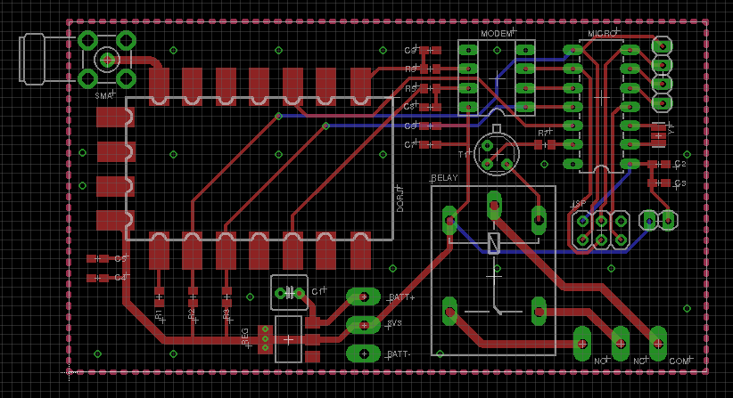
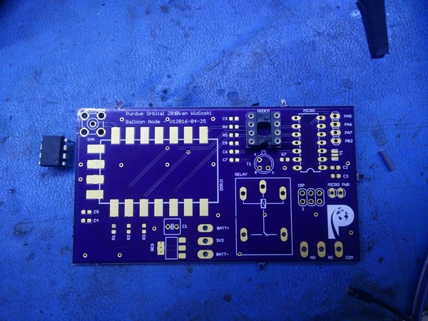
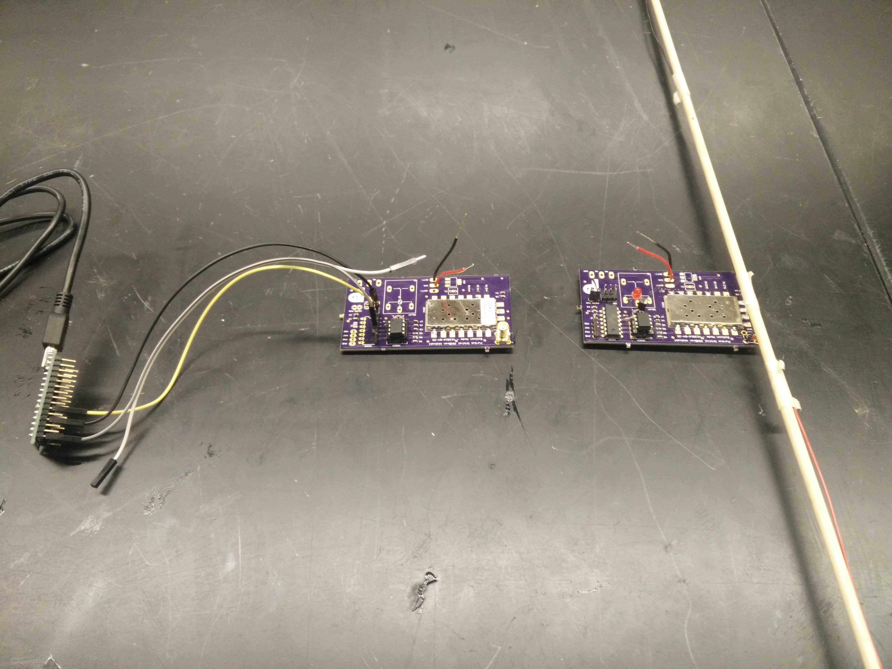

However, there was one more problem.  The ATTiny85 is a fairly underpowered device, and with all the multiplications I was doing, I was using up most of the sample period performing computations.  With the sample period now cut in half, there wasn't enough time to finish the DFT calculation before the next sample came in.  My first thought to a solution was to simply use an external 16 MHz crystal rather than the built in 8 MHz oscillator.

After some research, I learned I could use the ATTiny's PLL as a clock source to double the frequency of the built in oscillator and achieve the desired 16 MHz.  This was just a new target in my makefile:

``` make
16mhz-pll:
  avrdude -v -p $(DEVICE) -c $(PROGRAMMER) -P $(PORT) -U lfuse:w:0xf1:m -U hfuse:w:0xdf:m -U efuse:w:0xff:m

```
## Packetized Data

 1     | 2       | 3     4 | 5      6 | 7
-------|---------|---------|----------|------
 start | address | payload | checksum | end

I was able to issue commands from a master device and control an LED (and other GPIO) on a slave device as well as receive information back from the slave. From limited range tests I performed, the radios are able to transmit at least a mile with line-of-sight, but quite possibly much more than that. I ran out of space before the signal began dropping.

## Antenna Tuning

Antennas are easily the point of greatest loss in range and throughput in amateur radio, and any mismatches between transmitter and antenna impedance cause reflections and loss of transmission power. I used a network analyzer to measure and compensate my crappy dipole antenna so that it matched the 50 ohm output impedance of the radio module for greater range.

From the first Smith chart, we see that antenna has an impedance of 57+45j ohm at 144 MHz. If we can add some capacitance in series with the antenna, we can kill off the reactive component and get 57 ohm, which is "close enough".

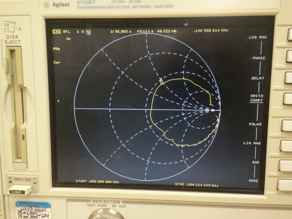
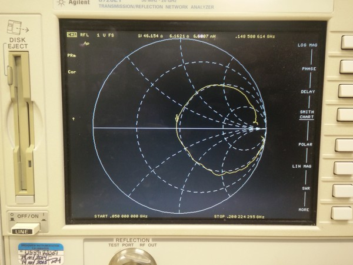
