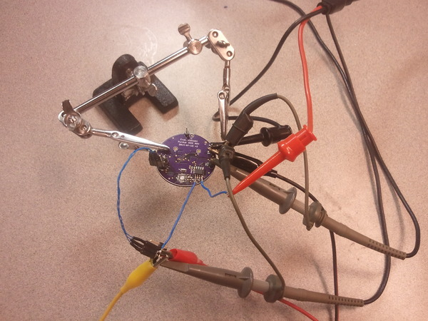
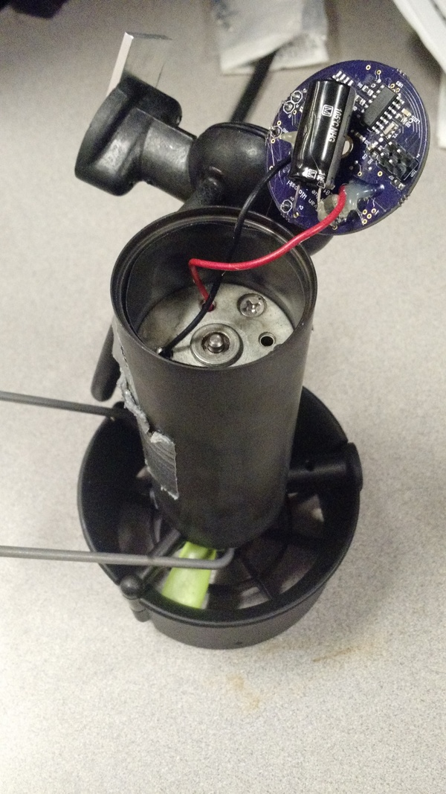

[Project files](http://github.com/evidlo/motorcontroller)

Shown below is a motor controller for the Seabotix BD-166 thruster.  These thrusters are designed to go on ROVs and can withstand depths of several hundred feet.  The BD-166 in particular keeps it's motor controller inside of the thruster itself which reduces wiring and saves space in the main electronics compartment.  

At some point, there was a communication disconnect with Seabotix and somebody on the ROV team the previous year had powered these off 50VDC, burning a nice hole through our very expensive boards.  'Twas a very bad day.

Our options were

* **a**) throw more money at these thrusters which already cost several hundred dollars to replace the boards
* **b**) switch to a different brand of thrusters and take a loss on these
* **c**) design a new motor controller to replace the original units

**a** was out since it would cost another few thousand to get all the drivers replaced.  At the time, there were no good alternatives to the Seabotix thrusters in this niche market, so **b** was out, too (note: there exist some [decent alternatives](http://www.bluerobotics.com/) now).
Eventually I went with the third option, designing my own motor controllers to replace the units.

Here are the 5 iterations of the board showing layout progression as well as a few parts changing.  About halfway through, I realized my boards needed to have a screwhole to keep the board from bumping around in the thruster case.  Another big issue I had was the layout for the power mosfets (the second row of components from the top).

If you notice that the pads change slightly between V5 and V6, this is because I was using a part from the Eagle library that was every so slightly incorrect.  This made the boards very unreliable and was a major headache until I figured out what the problem was.

