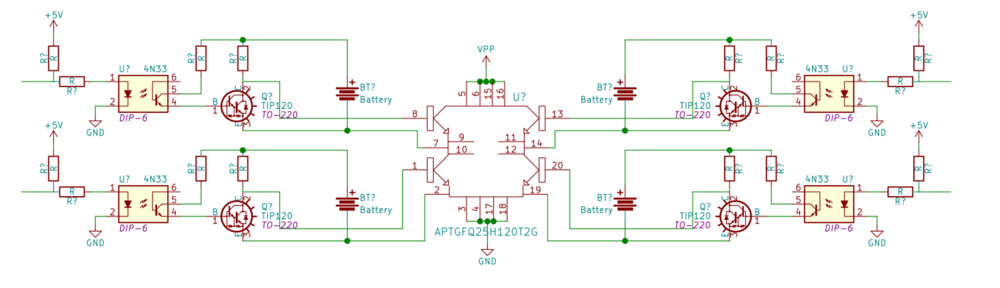
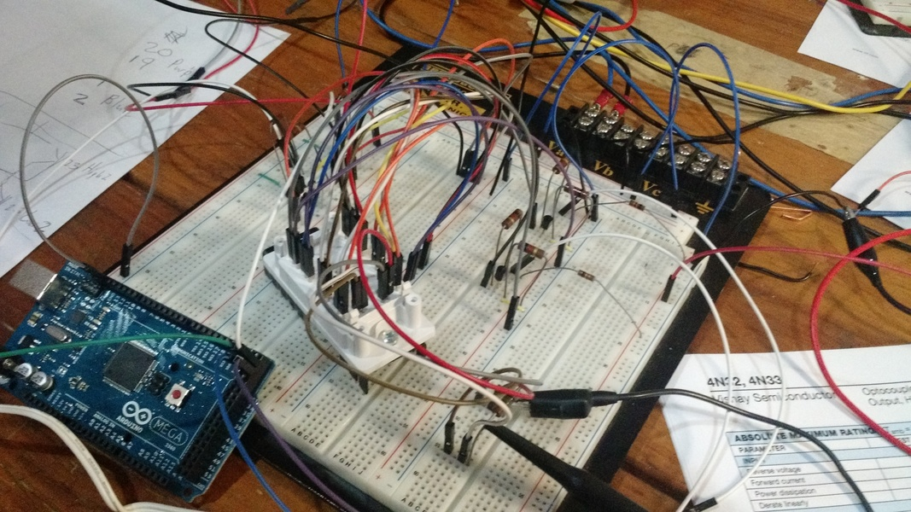
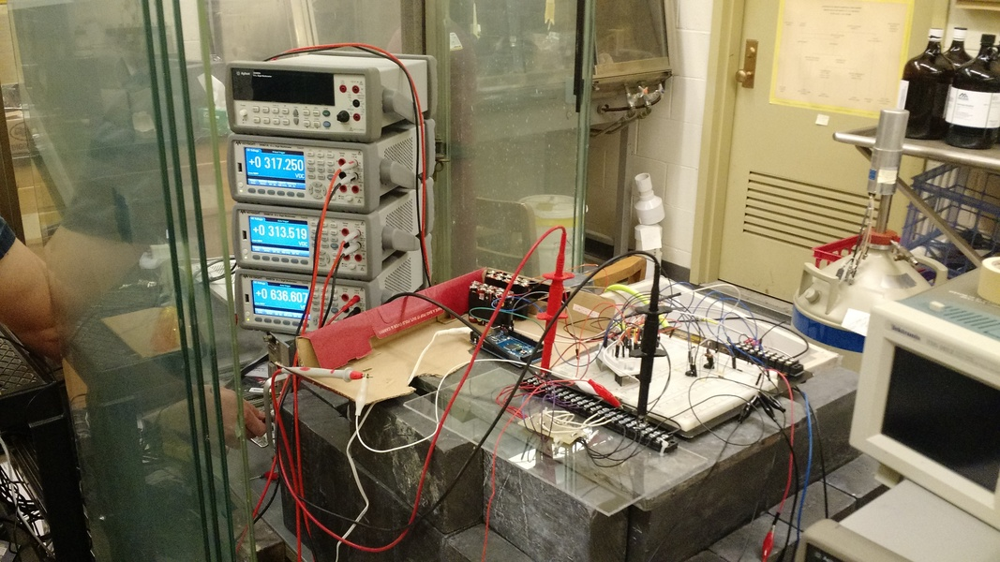

In this project I was helping a grad student run some tests for his master's project.  He needed to switch a few hundred volts across a gas-filled radiation chamber, so the obvious choice was an h-bridge.  Since this was just a test of the chamber to get some measurements, the hbridge never really left the breadboard stage, but it still performed nicely.

I dislike messing with bootstrap systems, so I chose to use optoisolators and a floating supply to drive the high side gates.  Quick and dirty, but it works.  I also added optoisolators to the low side gates to make sure they have the same turn on delay as the high ones.

