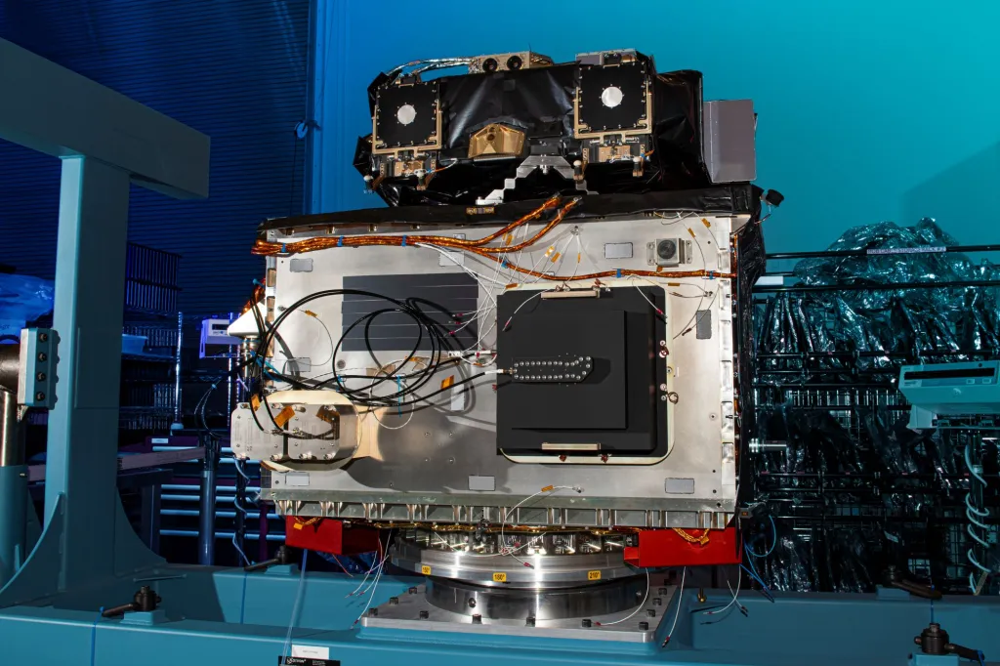
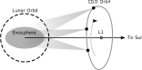
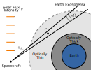

<link rel="stylesheet" href="https://cdn.jsdelivr.net/npm/katex@0.10.2/dist/katex.min.css" integrity="sha384-yFRtMMDnQtDRO8rLpMIKrtPCD5jdktao2TV19YiZYWMDkUR5GQZR/NOVTdquEx1j" crossorigin="anonymous">

Carruthers Geocoronal Observatory (CGO) is a recently selected small satellite mission that will help physicists understand the uppermost parts of the Earth's atmosphere.  It contains two UV imagers that will take pictures of the light from the Sun scattering off hydrogen in the Earth's exosphere.

Carruthers will orbit around L1, a point of gravitational equilibrium about 1.5 million km from the Earth where it will be able to observe the entirety of the exosphere continuously over several years.

From each vantage along its orbit CGO measures the number of hydrogen atoms in a series of cone shaped slices through the atmosphere; one cone per pixel on the sensor.

If enough of these slices are collected from different measurement locations, it is possible to reconstruct the full 3D hydrogen density.  This process is known as [tomographic reconstruction](https://en.wikipedia.org/wiki/Tomographic_reconstruction).  Note that this only applies to the uppermost part of the atmosphere, as the lower thick part of the atmosphere is dense enough that photons generally scatter multiple times before being detected, requiring a more complicated [radiative transfer](https://en.wikipedia.org/wiki/Radiative_transfer) model.

My research on the Carruthers mission pertains to answering the following questions:

1. Given the limited number of measurement locations available in the CGO orbit, how can we incorporate prior knowledge about the distribution of hydrogen to "fill in" the gaps in our measurements.
2. If the distribution of hydrogen evolves while measurements are taken, how can knowledge of this evolution be integrated into reconstructions?
3. Given the above questions, how can we verify CGO reconstructions will meet mission requirements on reconstruction accuracy and precision?

Answering these questions will form the bulk of the work of my PhD.

<!-- If enough of these slices are collected from different measurement locations, it is possible to reconstruct the full 3D density $x$.  This process is known as [tomographic reconstruction](https://en.wikipedia.org/wiki/Tomographic_reconstruction).  Note that this only applies to the optically thin part of the atmosphere, as the thick part of the atmosphere is dense enough that photons generally scatter multiple times before being detected, requiring a [radiative transfer](https://en.wikipedia.org/wiki/Radiative_transfer) model that is more complicated than the equation given above. -->

<!--  -->

<!-- Each pixel $j$ from vantage point $i$ measures the number of photons from a narrow slice of the atmosphere according to -->

<!-- $$y_{v,j} = g \int_{v_{i,j}} x(\vec{r}) d \vec{r}$$ -->

<!-- If enough of these slices are collected from different measurement locations, it is possible to reconstruct the full 3D density $x$.  This process is known as [tomographic reconstruction](https://en.wikipedia.org/wiki/Tomographic_reconstruction).  Note that this only applies to the optically thin part of the atmosphere, as the thick part of the atmosphere is dense enough that photons generally scatter multiple times before being detected, requiring a [radiative transfer](https://en.wikipedia.org/wiki/Radiative_transfer) model that is more complicated than the equation given above. -->
